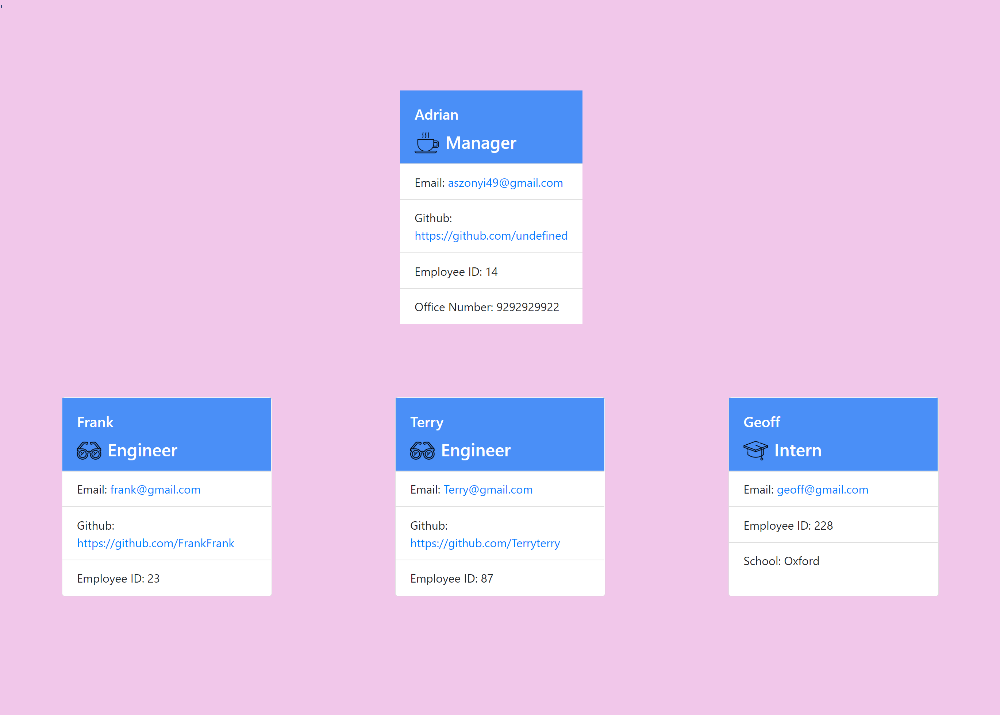

# ReadMe-Generator

## Table of Contents

- [Description](#Description)
- [Installation](#Installation)
- [Tests](#Tests)
- [Contributing](#Contributing)
- [License](#License)
- [Usage](#Usage)
- [Questions](#Questions)

## Description

This project runs on node.js and allows users to generate their own team of engineers and interns for a new project. You start by creating a project manager and then you can follow the prompts to create cards and store info for engineers and interns on the team.

## Installation

The application runs on node.js and is using npm inquirer. The tests are using jest which should also be installed. You will need to copy the code in Visual Studio and then open the integrated terminal to run the node commands

## Tests

Please install Jest to run the test files

## Contributing

Adrian Szonyi

## License

The MIT License (MIT) Copyright (c) 2015 Chris Kibble Permission is hereby granted, free of charge, to any person obtaining a copy of this software and associated documentation files (the Software), to deal in the Software without restriction, including without limitation the rights to use, copy, modify, merge, publish, distribute, sublicense, and/or sell copies of the Software, and to permit persons to whom the Software is furnished to do so, subject to the following conditions The above copyright notice and this permission notice shall be included in all copies or substantial portions of the Software. THE SOFTWARE IS PROVIDED AS IS, WITHOUT WARRANTY OF ANY KIND, EXPRESS OR IMPLIED, INCLUDING BUT NOT LIMITED TO THE WARRANTIES OF MERCHANTABILITY, FITNESS FOR A PARTICULAR PURPOSE AND NONINFRINGEMENT. IN NO EVENT SHALL THE AUTHORS OR COPYRIGHT HOLDERS BE LIABLE FOR ANY CLAIM, DAMAGES OR OTHER LIABILITY, WHETHER IN AN ACTION OF CONTRACT, TORT OR OTHERWISE, ARISING FROM, OUT OF OR IN CONNECTION WITH THE SOFTWARE OR THE USE OR OTHER DEALINGS IN THE SOFTWARE.

## Usage

Have node installed on your device, then open the integrated terminal in Visual Studio and type in node index.js Next answer the prompted questions to generate your new team.

video walkthrough link: (https://watch.screencastify.com/v/LbMUbXKs8VKWv8denHvf)

## Screenshot

## Questions

My Github Profile link: [_here_](https://github.com/Adrian-szonyi)
if you have any additional questions you can reach me using the details below:

Email: aszonyi49@gmail.com
